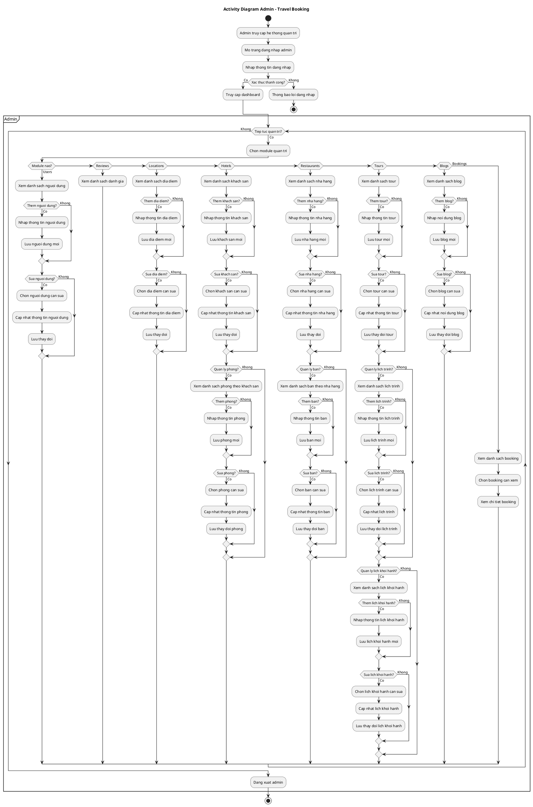

# Activity Diagram Admin

```plantuml
@startuml
title Activity Diagram Admin - Travel Booking

start

:Admin truy cap he thong quan tri;
:Mo trang dang nhap admin;
:Nhap thong tin dang nhap;

if (Xac thuc thanh cong?) then (Co)
	:Truy cap dashboard;
else (Khong)
	:Thong bao loi dang nhap;
	stop
endif

partition Admin {
	while (Tiep tuc quan tri?) is (Co)
		:Chon module quan tri;

		if (Module nao?) then (Users)
			:Xem danh sach nguoi dung;
			if (Them nguoi dung?) then (Co)
				:Nhap thong tin nguoi dung;
				:Luu nguoi dung moi;
			else (Khong)
			endif
			if (Sua nguoi dung?) then (Co)
				:Chon nguoi dung can sua;
				:Cap nhat thong tin nguoi dung;
				:Luu thay doi;
			else (Khong)
			endif

		elseif (Reviews)
			:Xem danh sach danh gia;

		elseif (Locations)
			:Xem danh sach dia diem;
			if (Them dia diem?) then (Co)
				:Nhap thong tin dia diem;
				:Luu dia diem moi;
			else (Khong)
			endif
			if (Sua dia diem?) then (Co)
				:Chon dia diem can sua;
				:Cap nhat thong tin dia diem;
				:Luu thay doi;
			else (Khong)
			endif

		elseif (Hotels)
			:Xem danh sach khach san;
			if (Them khach san?) then (Co)
				:Nhap thong tin khach san;
				:Luu khach san moi;
			else (Khong)
			endif
			if (Sua khach san?) then (Co)
				:Chon khach san can sua;
				:Cap nhat thong tin khach san;
				:Luu thay doi;
			else (Khong)
			endif
			if (Quan ly phong?) then (Co)
				:Xem danh sach phong theo khach san;
				if (Them phong?) then (Co)
					:Nhap thong tin phong;
					:Luu phong moi;
				else (Khong)
				endif
				if (Sua phong?) then (Co)
					:Chon phong can sua;
					:Cap nhat thong tin phong;
					:Luu thay doi phong;
				else (Khong)
				endif
			else (Khong)
			endif

		elseif (Restaurants)
			:Xem danh sach nha hang;
			if (Them nha hang?) then (Co)
				:Nhap thong tin nha hang;
				:Luu nha hang moi;
			else (Khong)
			endif
			if (Sua nha hang?) then (Co)
				:Chon nha hang can sua;
				:Cap nhat thong tin nha hang;
				:Luu thay doi;
			else (Khong)
			endif
			if (Quan ly ban?) then (Co)
				:Xem danh sach ban theo nha hang;
				if (Them ban?) then (Co)
					:Nhap thong tin ban;
					:Luu ban moi;
				else (Khong)
				endif
				if (Sua ban?) then (Co)
					:Chon ban can sua;
					:Cap nhat thong tin ban;
					:Luu thay doi ban;
				else (Khong)
				endif
			else (Khong)
			endif

		elseif (Tours)
			:Xem danh sach tour;
			if (Them tour?) then (Co)
				:Nhap thong tin tour;
				:Luu tour moi;
			else (Khong)
			endif
			if (Sua tour?) then (Co)
				:Chon tour can sua;
				:Cap nhat thong tin tour;
				:Luu thay doi tour;
			else (Khong)
			endif
			if (Quan ly lich trinh?) then (Co)
				:Xem danh sach lich trinh;
				if (Them lich trinh?) then (Co)
					:Nhap thong tin lich trinh;
					:Luu lich trinh moi;
				else (Khong)
				endif
				if (Sua lich trinh?) then (Co)
					:Chon lich trinh can sua;
					:Cap nhat lich trinh;
					:Luu thay doi lich trinh;
				else (Khong)
				endif
			else (Khong)
			endif
			if (Quan ly lich khoi hanh?) then (Co)
				:Xem danh sach lich khoi hanh;
				if (Them lich khoi hanh?) then (Co)
					:Nhap thong tin lich khoi hanh;
					:Luu lich khoi hanh moi;
				else (Khong)
				endif
				if (Sua lich khoi hanh?) then (Co)
					:Chon lich khoi hanh can sua;
					:Cap nhat lich khoi hanh;
					:Luu thay doi lich khoi hanh;
				else (Khong)
				endif
			else (Khong)
			endif

		elseif (Blogs)
			:Xem danh sach blog;
			if (Them blog?) then (Co)
				:Nhap noi dung blog;
				:Luu blog moi;
			else (Khong)
			endif
			if (Sua blog?) then (Co)
				:Chon blog can sua;
				:Cap nhat noi dung blog;
				:Luu thay doi blog;
			else (Khong)
			endif

		else (Bookings)
			:Xem danh sach booking;
			:Chon booking can xem;
			:Xem chi tiet booking;
		endif

	endwhile (Khong)

	:Dang xuat admin;
}

stop
@enduml
```
